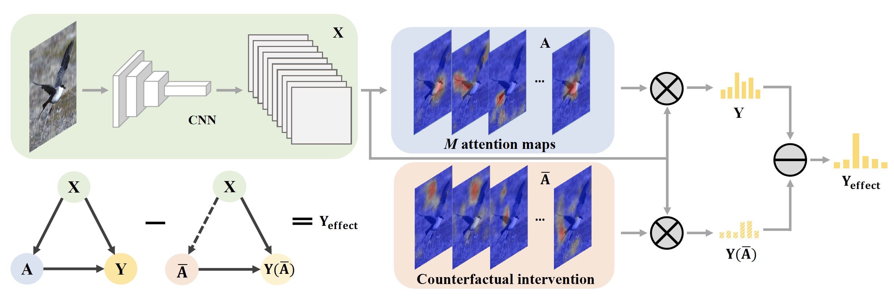

# Counterfactual Attention Learning

Created by [Yongming Rao](https://raoyongming.github.io/)\*, [Guangyi Chen](https://chengy12.github.io/)\*, [Jiwen Lu](https://scholar.google.com/citations?user=TN8uDQoAAAAJ&hl=en&authuser=1), [Jie Zhou](https://scholar.google.com/citations?user=6a79aPwAAAAJ&hl=en&authuser=1)

This repository contains PyTorch implementation for ICCV 2021 paper __Counterfactual Attention Learning for Fine-Grained Visual Categorization and Re-identification__ [[arXiv]](https://arxiv.org/abs/2108.08728)

We propose to learn the attention with counterfactual causality, which provides a tool to measure the attention quality and a powerful supervisory signal to guide the learning process. 



## CAL for Fine-Grained Visual Categorization

See [CAL-FGVC](fgvc/).

## CAL for Person Re-Identification

See [CAL-ReID](reid/).

## License
MIT License

## Citation
If you find our work useful in your research, please consider citing:
```
@inproceedings{rao2021counterfactual,
  title={Counterfactual Attention Learning for Fine-Grained Visual Categorization and Re-identification},
  author={Rao, Yongming and Chen, Guangyi and Lu, Jiwen and Zhou, Jie},
  booktitle={ICCV},
  year={2021}
}
```